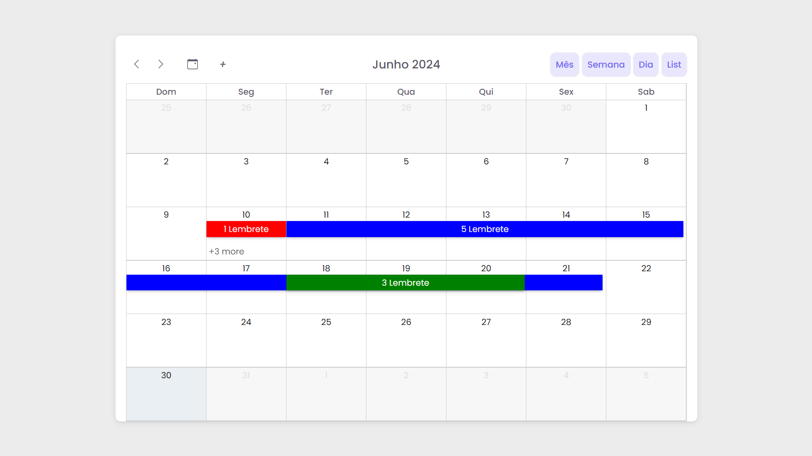

# Dynamic Calendar
#### Dynamic Calendar is a versatile calendar application that supports month, week, day, and list views. Users can effortlessly add events and seamlessly move them across the interface, providing a highly interactive and customizable scheduling experience.
<a href="https://vinicius-rodriguess.github.io/Dynamic-Calendar/" target="_blank">Click here to test the project!</a>

